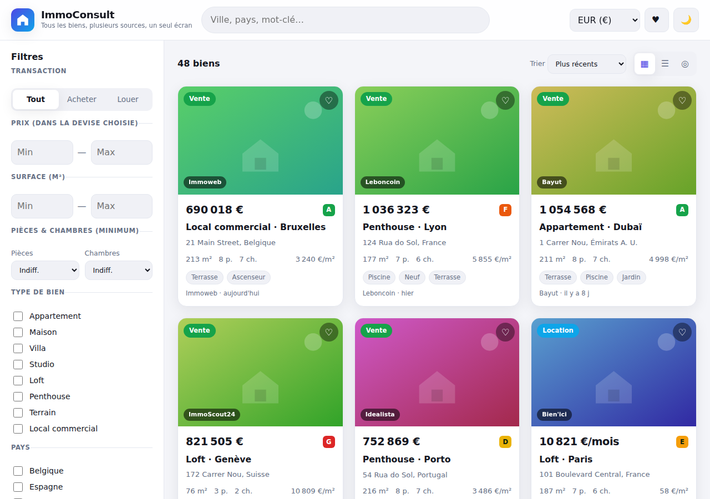

# 🏠 ImmoConsult

**Agrégateur immobilier multi-sources** — regroupe des biens en **vente** et en
**location** issus de plusieurs portails sur une seule interface, moderne,
responsive et riche en filtres.

> ⚡ 100 % statique · fonctionne directement sur **GitHub Pages** · aucun
> serveur requis pour la démo · thème clair/sombre automatique.



---

## ✨ Fonctionnalités

- **Recherche plein-texte** (ville, pays, mot-clé) avec autocomplétion.
- **Filtres avancés** : transaction (achat/location), type de bien, pays, prix
  min/max, surface, nombre de pièces et de chambres, équipements (piscine,
  terrasse, parking, vue mer…), classe énergie (DPE A→G).
- **Tri** : plus récents, prix croissant/décroissant, surface, **prix au m²**.
- **Multi-devises** (€, $, £, CHF, AED) avec conversion à la volée.
- **3 vues** : grille, liste et **carte interactive** (Leaflet + OpenStreetMap).
- **Estimateur de prix** : chaque bien est comparé à une référence de marché
  (« −10 % sous le marché ») — prêt à être alimenté par l'open data DVF.
- **Alertes / recherches sauvegardées** : soyez notifié des nouveaux biens.
- **Déduplication** multi-portails : « Vu sur 3 sites » + **cache** client.
- **Favoris** persistants (stockés dans le navigateur).
- **Fiche détail** complète en modale.
- **Responsive** : tiroir de filtres sur mobile, design fluide.
- **Architecture d'adaptateurs** : chaque source est un module isolé, facile à
  brancher ou débrancher.

### 🚀 Ce qu'aucun portail classique ne fait

Les portails vivent des agences et des vendeurs ; ImmoConsult est du côté de
l'**acheteur** :

- **Coût réel total** (pas le prix affiché) : notaire, taxe foncière, charges,
  **facture énergie déduite du DPE**, coût de possession sur 10 ans, et un
  **simulateur de crédit** (apport / durée / taux) en direct.
- **Score de négociabilité** : marge de baisse probable (ancienneté, baisses
  déjà appliquées, surévaluation vs marché).
- **Risques & qualité de vie hyperlocaux** : inondation, argiles, radon,
  sismique, pollution + bruit, air, écoles, commerces, transports, fibre →
  score /100.
- **Investissement** : loyer estimé, **rendement brut/net**, tendance du
  quartier, timing de marché.
- **Transparence copropriété** : lots, impayés, fonds travaux, procédures.
- **Alerte légale DPE** : « interdit à la location en 2028 » (passoires
  thermiques).
- **Détecteur d'anomalies / arnaques** : prix trop beau, DPE manquant, etc.
- **Recherche en langage naturel** : « appartement 3 pièces à Lyon avec
  terrasse moins de 500k » → filtres automatiques.
- **Recherche par temps de trajet** (isochrones), y compris **multi-points**.
- **Comparateur** de biens côte à côte (12 critères) + **notes** de visite.

---

## ⚖️ Sources de données — à lire avant tout

L'agrégation **automatique** (scraping) des grands portails
(SeLoger, Leboncoin, Bien'ici, Idealista, Rightmove, Zillow…) est **presque
toujours interdite** par leurs conditions d'utilisation et activement bloquée
techniquement. Ce projet est donc conçu pour ne consommer que des sources
**autorisées** :

| Source | Comment y accéder légalement |
| --- | --- |
| **API partenaires** | Programmes pro (ex. SeLoger Pro, flux XML agences, Apimo, Ubiflow) sur contrat. |
| **Flux publics** | Certaines agences/portails exposent des flux XML/JSON publics. |
| **Open data** | En France, **DVF** (Demandes de Valeurs Foncières, [data.gouv.fr](https://www.data.gouv.fr/)) donne les **prix de vente réels**. À l'international : registres cadastraux ouverts. |
| **Vos propres mandats** | Si vous êtes agence/réseau, vos annonces vous appartiennent. |

## 🌐 Données réelles branchées (DVF · BAN · Géorisques)

Le site tente d'abord de charger de **vraies données**, gratuites et sans clé :

| Donnée réelle | Source | Module |
| --- | --- | --- |
| **Transactions** (prix, surface, pièces, date, adresse) | **DVF** via `api.cquest.org/dvf` | `sources/dvf.js` |
| **Référence de marché** (€/m² médian par ville) | calculée sur les transactions DVF chargées | `estimator.js` |
| **Géocodage de commune** | **BAN** (`api-adresse.data.gouv.fr`) | `geo.js` |
| **Risques** (inondation, argiles, radon, sismique…) | **Géorisques** (`georisques.gouv.fr`) | `risks.js` |

- Au démarrage, quelques communes réelles sont chargées ; la barre
  **« Charger une commune »** permet d'afficher les transactions réelles de
  n'importe quelle ville française.
- Les risques Géorisques sont récupérés **à l'ouverture d'une fiche** (France).
- ⚠️ Ce sont des **ventes réalisées** (pas des annonces en cours) et la
  couverture est **française**.

> **CORS / proxy.** Ces API sont appelées **depuis le navigateur**. Si l'une
> d'elles n'autorise pas les requêtes cross-origin (ou est momentanément
> indisponible), l'application **bascule automatiquement en mode
> démonstration** et l'affiche dans un bandeau. Pour fiabiliser, placez un
> petit **proxy serverless** (Cloudflare Worker / Vercel Function) devant ces
> API et pointez `DVF`, `BAN` et l'URL Géorisques dessus. Les analyses sans
> source ouverte gratuite (négociation, copropriété) sont **masquées** sur les
> données réelles ; les blocs restants sont marqués « estimé ».

Le jeu de données de **démonstration** (fictif) reste disponible en repli.

---

## 🔌 Brancher une vraie source

Chaque source est un module dans `assets/js/sources/` qui expose ce contrat :

```js
export const maSource = {
  id: 'ma-source',
  label: 'Ma source',
  enabled: true,
  async fetchListings(signal) {
    const res = await fetch('https://mon-proxy.example/immo', { signal });
    const raw = await res.json();
    return raw.map(normalize); // -> tableau au schéma normalisé (voir data.js)
  },
};
```

Puis on l'ajoute au registre `assets/js/sources/index.js`. Le reste de
l'application (filtres, tri, affichage) fonctionne sans modification, car
toutes les annonces partagent le **même schéma normalisé** (voir le
commentaire en tête de `assets/js/data.js`).

> 🔐 **Ne mettez jamais** une clé d'API secrète dans ce code : il est public.
> Passez par un petit **proxy serverless** (Cloudflare Worker, Vercel/Netlify
> Function) qui garde la clé côté serveur, applique la mise en cache et le
> respect des quotas, et que le front appelle.

---

## 🧩 Fonctionnalités avancées

### 🗺️ Carte interactive (Leaflet)

La vue **Carte** utilise [Leaflet](https://leafletjs.com/) (embarqué dans
`assets/vendor/leaflet/`, aucune dépendance CDN) avec les tuiles gratuites
**OpenStreetMap**. Chaque bien est un marqueur étiqueté par son prix ; un clic
ouvre la fiche. Si Leaflet est indisponible (hors ligne), un repli schématique
prend le relais. Pour des tuiles premium, remplacez l'URL du `tileLayer` dans
`assets/js/app.js` (Mapbox, MapTiler…).

### 📈 Estimateur de prix (open data DVF)

`assets/js/estimator.js` compare le prix au m² d'un bien à une **référence de
marché** et affiche l'écart (« −10 % sous le marché »). Les références sont
actuellement des valeurs de démonstration par ville. **Pour des valeurs
réelles**, calculez côté back-end des agrégats de l'open data
**[DVF](https://www.data.gouv.fr/fr/datasets/demandes-de-valeurs-foncieres/)**
(prix de vente réels) par commune/quartier, exposez-les en JSON, et remplissez
`MARKET_REF` (ou remplacez `estimate()` par un `fetch`).

### 🔔 Alertes / recherches sauvegardées

`assets/js/alerts.js` enregistre les recherches dans le navigateur et signale
les nouveaux biens correspondants à chaque visite (badge 🔔). **L'envoi
d'e-mails réels** nécessite un back-end : définissez

```html
<script>window.IMMOCONSULT_ALERT_ENDPOINT = 'https://mon-api.example/alertes';</script>
```

L'app y enverra alors `{ email, name, filters }`. Côté serveur, une fonction
serverless stocke l'alerte et déclenche l'e-mail via votre fournisseur
(Resend, SendGrid, Mailgun, Postmark…) sur un cron qui compare aux nouvelles
annonces.

### 🧬 Déduplication & cache

- `assets/js/dedupe.js` regroupe les annonces qui décrivent le même bien
  (même type/ville/surface/pièces + prix proche) sur plusieurs portails et les
  fusionne en une fiche « Vu sur N sites ».
- `assets/js/cache.js` met en cache les annonces dans le navigateur (TTL
  10 min) pour éviter de re-solliciter les sources. En production, ce cache se
  double d'un cache serveur (Redis/KV) devant les API partenaires.

### 🧠 Analyses « acheteur » & sources de données réelles

Chaque bien est enrichi en une passe par `assets/js/insights.js`, qui appelle
des modules indépendants. Tous fonctionnent sur des barèmes/valeurs de
**démonstration** ; voici où brancher les données réelles :

| Module | Fait | Donnée réelle à brancher |
| --- | --- | --- |
| `cost.js` | Notaire, taxe foncière, charges, énergie (DPE), coût 10 ans, **crédit** | Barèmes locaux ; DPE réel de l'annonce |
| `negotiation.js` | Marge de négociation | Historique de prix réel (suivi des annonces dans le temps) |
| `risks.js` | Inondation, argiles, radon, sismique, bruit, air, écoles, fibre | **Géorisques**, **Bruitparif**, **Atmo**, annuaire écoles, **ARCEP** |
| `invest.js` | Rendement locatif, tendance, timing | Observatoires des loyers (open data) |
| `copro.js` | Lots, impayés, fonds travaux, procédures | Registre national des copropriétés (open data) |
| `legal.js` | Interdiction DPE (2025/2028/2034) | Loi Climat & Résilience (règles intégrées) |
| `commute.js` | Temps de trajet (vol d'oiseau × facteur) | API d'isochrones **IGN / OpenRouteService / Mapbox** |
| `search-nlp.js` | Analyse de la requête (règles) | Optionnel : un LLM via proxy renvoyant le même objet de filtres |

Chaque module renvoie un objet simple et testable ; remplacer la source de
données ne touche ni l'affichage ni le reste de l'application.

---

## 🚀 Déploiement sur GitHub Pages

Un workflow (`.github/workflows/deploy.yml`) publie le site automatiquement à
chaque push sur `main`.

1. **Settings → Pages → Build and deployment → Source : GitHub Actions.**
2. Poussez sur `main`. Le site sera servi sur
   `https://<votre-nom>.github.io/ImmoConsult/`.

---

## 🛠️ Développement local

Le site utilise des **modules ES**, il faut donc un serveur HTTP (pas `file://`) :

```bash
python3 -m http.server 8000
# puis http://localhost:8000
```

---

## 🗂️ Structure

```
index.html                    Page + structure
assets/css/styles.css         Design (clair/sombre, responsive)
assets/js/app.js              Orchestration : rendu, filtres, carte, alertes…
assets/js/data.js             Schéma + jeu de données de démonstration
assets/js/filters.js          Prédicat de filtrage partagé (app + alertes)
assets/js/estimator.js        Estimation de prix (référence marché / DVF)
assets/js/dedupe.js           Déduplication multi-portails
assets/js/cache.js            Cache client des annonces (TTL)
assets/js/alerts.js           Alertes / recherches sauvegardées
assets/js/insights.js         Agrégateur d'analyses par bien
assets/js/cost.js             Coût réel total + simulateur de crédit
assets/js/negotiation.js      Score de négociabilité
assets/js/risks.js            Risques & qualité de vie (Géorisques…)
assets/js/legal.js            Calendrier d'interdiction DPE
assets/js/copro.js            Transparence copropriété
assets/js/invest.js           Rendement locatif & timing marché
assets/js/anomaly.js          Détecteur d'anomalies / arnaques
assets/js/commute.js          Recherche par temps de trajet (isochrones)
assets/js/search-nlp.js       Recherche en langage naturel
assets/js/geo.js              Géocodage réel (BAN)
assets/js/util.js             Utilitaires (hash, RNG, crédit, distance)
assets/js/sources/dvf.js      Source RÉELLE : transactions DVF
assets/js/sources/            Adaptateurs de sources (registre + démo)
assets/vendor/leaflet/        Leaflet embarqué (carte interactive)
.github/workflows/deploy.yml  Déploiement GitHub Pages
```

---

## 🧭 Pistes d'évolution

Prochaines briques utiles : back-end d'agrégation avec cache serveur et
respect des quotas, historique des prix, comparateur de biens, calculette de
crédit, PWA installable + notifications, SEO (données structurées
`schema.org/RealEstateListing`), i18n multilingue, comptes utilisateurs.

---

## 📄 Licence

MIT — voir [LICENSE](LICENSE).
